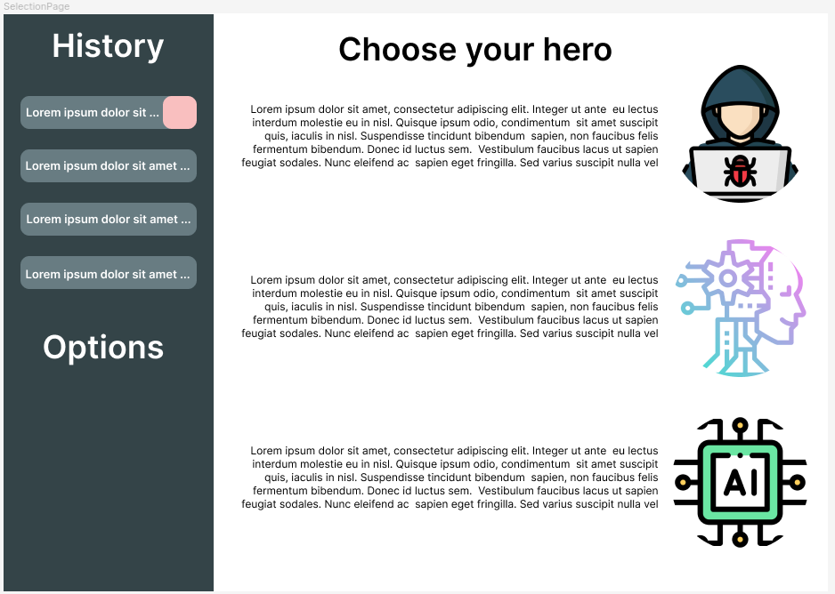
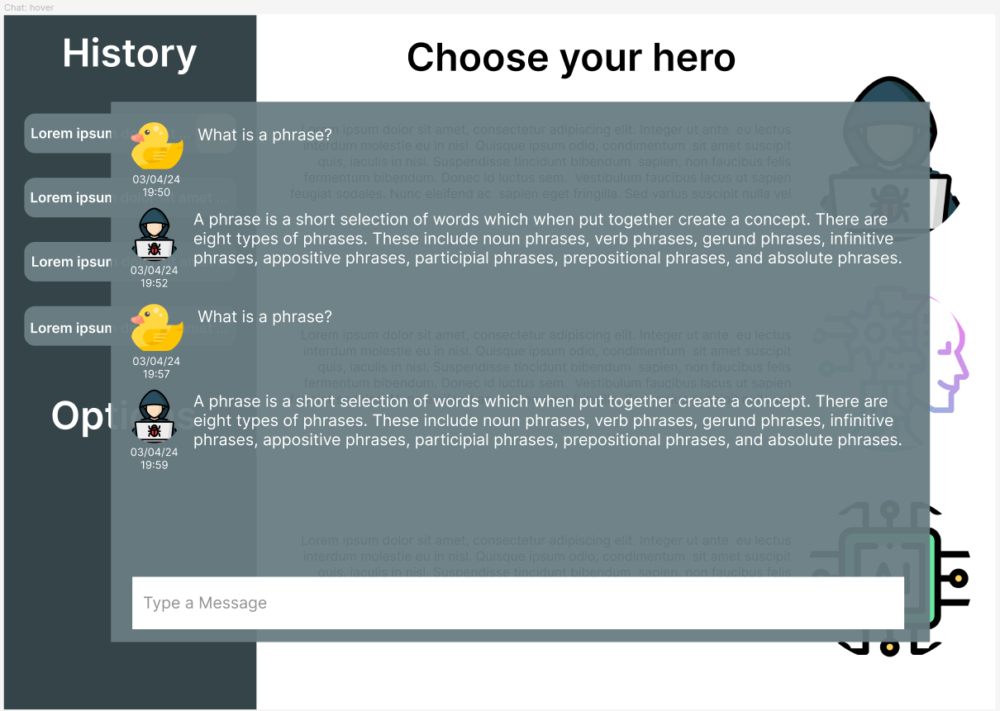
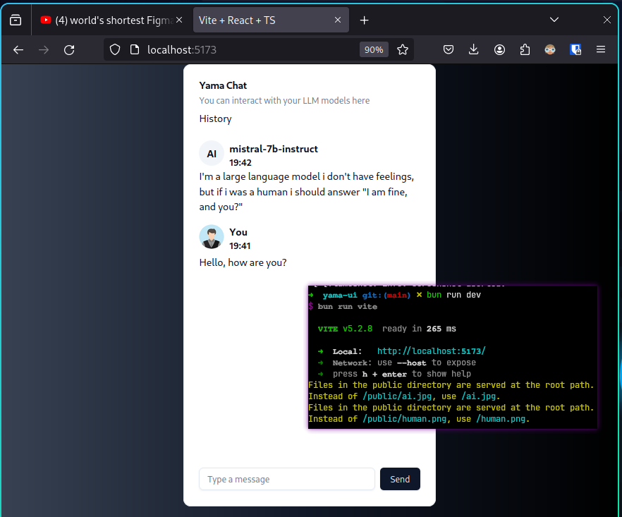

<h2 style="text-align:center">
    YamaUI - Yet another ollama User Interface
</h2>

**Equipe:** Lucas Rodrigues de Almeida e Mateus Loss  
**Disciplina:** Projeto Integrado 1  
**Professor:** Vitor Estevao Silva Souza

---
## Problema
Com o advento do ChatGPT, as pessoas tem optado por centralizar suas buscas em um LLM ao invés de fazer consultas a um sistema de busca tipo o Google. 
Um LLM (Large Language Model) é um modelo de inteligência artificial treinado em grandes quantidades de texto para compreender e gerar linguagem humana de maneira contextual e coerente. Porém, ainda assim, muitas pessoas tem preocupações com sua privacidade ao interagir com esses modelos. Além das questões de privacidade pessoal, há dados empresariais que não podem ser compartilhados com a empresa dona do LLM, por exemplo, OpenAI.

- https://exame.com/tecnologia/samsung-proibe-uso-de-ia-apos-vazamento-de-dados-com-chatgpt/
- https://www.adrenaline.com.br/noticias/engenheiros-da-samsung-vazaram-dados-confidenciais-usando-o-chatgpt/
- https://www.linkedin.com/pulse/chatgpt-can-leak-sensitive-data-how-do-companies-protect

## Solução
Apesar do risco, há uma forte demanda pela interação com LLM e uma forte preocupação com o vazamento de dados. Sendo assim, Hugging Face e Ollama oferecem soluções para facilitar o acesso e a colaboração no campo de modelos de linguagem grandes (LLMs), mitigando riscos como o vazamento de dados e o uso irresponsável de IA.

**[Hugging Face](https://huggingface.co/)** democratiza o acesso a tecnologias de aprendizado de máquina (ML) ao fornecer uma plataforma robusta onde pesquisadores, desenvolvedores e entusiastas podem compartilhar, explorar e colaborar em modelos, conjuntos de dados e aplicações de ML. Com ferramentas para controlar o acesso e garantir a segurança, Hugging Face aborda preocupações sobre a privacidade dos dados e promove um uso responsável de LLMs através de Model Cards que detalham as limitações e vieses dos modelos.

**[Ollama](https://ollama.com/)**, por outro lado, é uma ferramenta que permite aos usuários interagir com LLMs de maneira mais segura e controlada, similar a como o Docker facilita a criação e o gerenciamento de containers para aplicações. Isso ajuda a mitigar riscos associados ao vazamento de dados, fornecendo um ambiente isolado e controlado para a execução de modelos de linguagem, o que é crucial para proteger as informações sensíveis e garantir a segurança dos dados enquanto se experimenta com essas poderosas tecnologias de IA.

Ainda assim, a interface do usuário provida pelo Ollama é através de linha de comando. Porém, além da linha de comando, é oferecido um endpoint REST e bibliotecas JavaScript para interagir com os LLMs. Sendo assim, iremos construir uma interface amigável para que qualquer usuário leigo possa interagir de maneira simples com os LLMs.

Prezando pela simplicidade, mesmo que o usuário não tenha as dependências, iremos oferecer uma instalação all-in-one com apenas um comando. Incluindo a possibilidade de subir uma infraestrutura em núvem para que não haja a necessidade de instalação local.

### Principais Funcionalidades
- Tela de escolha para qual modelo o usuário deseja interagir
- Histórico de conversas, deve conter todas as informações sobre uma conversa. Por exemplo, data-hora de cada mensagem da conversa e o nome do LLM.
- Chat dinâmico, após uma pergunta, deve ser mostrado a resposta na tela a saída conforme taxa de cálculo do LLM.
- Tela dinâmica, conforme a saída do LLM ocupar mais que o espaço na tela, deve-se ser possível scrollar para que seja renderizado as mensagens antigas.

## Público Alvo
Nosso público-alvo é bem abrangente, abrange desde os indivíduos completamente leigos que queiram começar a interagir com inteligência artificial até a usuários mais experiêntes que queiram subir a aplicação na núvem.
Qualquer entusiasta que queira se divertir com um LLM poderá desfrutar da nossa aplicação.
Nosso propósito é ter várias opções de deployment da aplicação para cada tipo de usuário.

### Tipos de usuário
- Iniciante: Tudo permanecerá local sem a necessidade de docker.
- Adepto à docker: Basta ter o docker instalado, tudo irá rodar em um container local.
- Adepto à nuvem: Absolutamente nada irá rodar local, basta ter uma API da AWS. A infraestrutura será provisionada como código.

## Tecnologias

**Linguagem:** JavaScript e TypeScript, 
**Runtime/Package Manager:** Bun, 
**Module Bundler**: Vite, 
**Framework JS:** React, 
**Framework CSS:** Tailwind, 
**VCS:** Git, 
**CI/CD:** GitHub e GitHub Actions, 
**Deployment:** Docker Compose e Terraform, 
**Banco de Dados:** PostgreSQL.

## [Protótipo de Telas](https://www.figma.com/design/PzntKU1twmJilNSBLp5jX7/yama-ui?node-id=0%3A1&t=ZrH2xKhmKIviANk3-1)

 
 
 
 
 
 

## Prova de Conceito

